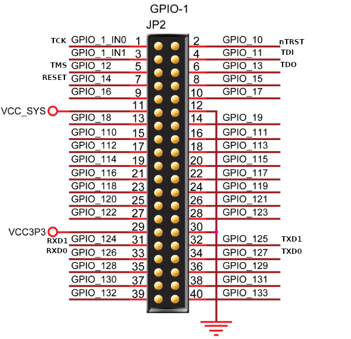

# NEORV32-DE0-nano
RISC-V NEORV32 implementation for DE0-Nano, with SW examples (Fill in the build steps)

Among other things this repo documents the steps to build and run the NEORV32 implementation on a DE0-nano.

The development environment for this work is:
1. Ubuntu 22.04
2. Quartus versions 13.1, 15.1 and 18.1 running in an Ubuntu 16.04 Docker image
3. Quartus versions 20.1, 21.1 and 22.1std running native
4. RISC-V GCC [toolchain](https://github.com/riscv-collab/riscv-gnu-toolchain)
   * **build with Newlib**
   * ./configure --prefix=/opt/riscv --with-arch=rv32gc --with-abi=ilp32d --enable-multilib
   * make

The first step is to compile and load the VHDL into the FPGA in the DE0-nano, this process uses the Quartus tool. The examples in neorv32-examples were developed with 15. Quartus 20 seems to be the last version with the SDRAM IP and good DE0-nano support but I was unable to flash the bits to the DE0-nano, as it did not seem to be worth the effort to know why I've been using 15.1.

In addition to the github repo for neorv32-examples there is a [webpage](https://www.emb4fun.de/riscv/neorv32/index.html) that goes into more detail. There is also [github repo](https://www.emb4fun.de/riscv/neorv32/index.html) of interest and the original [NEORV32 repo](https://www.emb4fun.de/riscv/neorv32/index.html)

**neorv32-examples/doc/fpgajtag.pdf** contains a schematic for an adapter to connect a standard 20pin JTAG connector along with serial port and an SPI Flash memory.


**Note: Pin 1 is top right with USB at the bottom**


|Signal|FPGA |Header    |Pin   |
|------|-----|----------|------|
|nTRST |F13  |GPIO_10   |JP2_2 |
|TCK   |T9   |GPIO_1_IN0|JP2_1 |
|TDI   |T15  |GPIO_11   |JP2_4 |
|TDO   |T13  |GPIO_13   |JP2_6 |
|TMS   |T14  |GPIO_12   |JP2_5 |
|RESET |R13  |GPIO_14   |JP2_7 |
|GND   |     |GND       |JP2_12|
|VCC3.3|     |VCC3.3    |JP2_11|
|GND   |     |GND       |JP2_30|
|TXD   |N14  |GPIO_127  |JP2_34|
|RXD   |L14  |GPIO_126  |JP2_33|

---
## Build NEORV32:
* <Quartus 15,1>
* File -> Open Project... -> …/NEORV32-DE0-nano/neorv32-examples/de0-nano/de0n-neorv32-sdram-qsys/hw/de0n-neorv32-sdram-qsys.qpf -> Open
* Under Project Navigator select **Files** right click on _src.top.vhd_Set as Top-Level Entry
* Processing -> Start Compilation
* Connect USB Serial adapter to UART pins and connect Terminal Program (gtkterm ?)
* Tools -> Programmer
  Notes for persistance:
  * Programming file type: _JTAG Indirect Configuration File (jic)_
  * Configuration device: _EPCS64_
  * Under _Input files to convert_ **Flash Loader** -> Add Device -> Cyclone IV E -> EP4CE22 -> OK
  *  **SOF Data** -> Add File double click *output_files* -> de0n-neorv32-sdram-qsys.sof -> OK
  *  Generate
  *  Tools -> Programmer
     * delete any files or devices
  *  Add File -> output_file.jic
  *  select **Program/Configure** for output_file.jic
  *  Start
  *  Disconnect DE0 and reconnect
---
## Build Software

* install RISC-V GCC [toolchain](https://www.emb4fun.de/riscv/neorv32/index.html)
* Add pathname to PATH e.g. ```export PATH=$PATH=/opt/riscv/bin/```
* In the directory **sw** are a number of software examples that build with the RISC-V GCC toolchain.

### neorv32-examples - de0n-neorv32-sdram-qsys

* The [webpage](https://www.emb4fun.de/riscv/ses4rv/index.html) details installing Seggar Embedded Studio and configuring a project to build the SDRAM memory test.
* After opening the project File -> Open Studio Folder -> Project Folder  neorv32-examples/de0-nano/de0n-neorv32-sdram-qsys/sw/prj_
  * The previous step should be verified I'm not sure it completely correct.
* Add the include directories _../../../../neorv32/sw/lib/include ../inc_.

